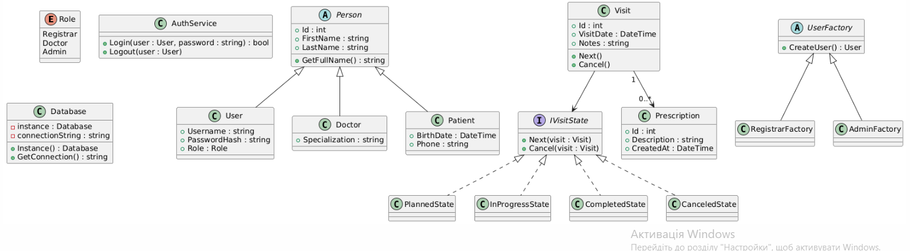
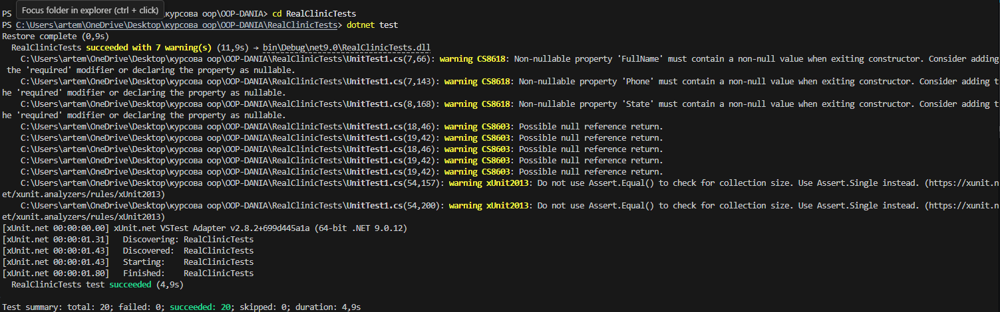

Реєстратура клініки: пацієнти та візити

моя дівграма UML та код  до неї 
 
classDiagram
    %% КОЛЬОРИ
    classDef ui fill:#E3F2FD,stroke:#1E88E5,stroke-width:2px;
    classDef bll fill:#E8F5E9,stroke:#43A047,stroke-width:2px;
    classDef dal fill:#FFF3E0,stroke:#FB8C00,stroke-width:2px;
    classDef pattern fill:#F3E5F5,stroke:#8E24AA,stroke-width:3px,color:#000;
    classDef model fill:#FFFDE7,stroke:#FBC02D,stroke-width:1px;

    %% ПАТЕРНИ
    class IVisitState {
        <<ПАТЕРН 1 СТАН>>
        <<interface>>
        +Handle(Visit visit)
    }
    class ClinicRepository {
        <<ПАТЕРН 2 РЕПОЗИТОРІЙ>>
        -ClinicDbContext _context
        +Add()
        +Update()
        +GetAll()
    }
    class ClinicService {
        <<ПАТЕРН 3 ФАСАД та DI>>
        -IClinicRepository _repository
        +GetPatients()
        +ScheduleVisit()
        +ChangeVisitState()
    }

    class IVisitState:::pattern
    class ClinicRepository:::pattern
    class ClinicService:::pattern

    %% UI (ВІКНА)
    class MainForm:::ui
    class AddDoctorForm:::ui
    class AddPatientForm:::ui
    class AddVisitForm:::ui

    %% БАЗА ДАНИХ
    class IClinicRepository:::dal {
        <<interface>>
    }
    class ClinicDbContext:::dal {
        +DbSet Users
        +DbSet Patients
        +DbSet Visits
    }

    %% МОДЕЛІ
    class User:::model
    class Patient:::model
    class Visit:::model {
        +IVisitState State
        +ChangeState()
    }
    class ScheduledState:::model
    class InProgressState:::model
    class CompletedState:::model

    %% НОТАТКИ
    note for IVisitState "ПАТЕРН STATE: Зміна статусу без if/else"
    note for ClinicRepository "ПАТЕРН REPOSITORY: Ізолює логіку бази даних"
    note for ClinicService "ПАТЕРН FACADE: Єдина точка входу"

    %% ЗВ'ЯЗКИ
    MainForm ..> ClinicService : Викликає методи
    AddDoctorForm ..> ClinicService : DI 
    AddPatientForm ..> ClinicService : DI
    AddVisitForm ..> ClinicService : DI

    ClinicService --> IClinicRepository : Використовує абстракцію
    IClinicRepository <|.. ClinicRepository : Реалізує інтерфейс
    ClinicRepository --> ClinicDbContext : SQL запити

    ClinicDbContext --> User : Зберігає
    ClinicDbContext --> Patient : Зберігає
    ClinicDbContext --> Visit : Зберігає

    Visit *-- IVisitState : Має поточний стан
    IVisitState <|.. ScheduledState : Заплановано
    IVisitState <|.. InProgressState : В процесі
    IVisitState <|.. CompletedState : Завершено
Та також ER-Діаграма 

erDiagram
    %% ТАБЛИЦЯ КОРИСТУВАЧІВ (ЛІКАРІ ТА АДМІНИ)
    USERS {
        int Id PK "Первинний ключ"
        string FullName "ПІБ (Лікар/Адмін)"
        string Login "Логін для входу"
        string Password "Пароль"
        int Role "Роль (0=Admin, 1=Doctor)"
    }

    %% ТАБЛИЦЯ ПАЦІЄНТІВ
    PATIENTS {
        int Id PK "Первинний ключ"
        string FullName "ПІБ пацієнта"
        datetime BirthDate "Дата народження"
        string Phone "Номер телефону"
    }

    %% ТАБЛИЦЯ ВІЗИТІВ (ЦЕНТРАЛЬНА ЛОГІКА)
    VISITS {
        int Id PK "Первинний ключ"
        int PatientId FK "Зв'язок з PATIENTS"
        int DoctorId FK "Зв'язок з USERS"
        datetime Date "Дата прийому"
        string State "Статус (Scheduled/InProgress/Completed)"
    }

    %% ЗВ'ЯЗКИ МІЖ ТАБЛИЦЯМИ
    PATIENTS ||--o{ VISITS : "має історію записів"
    USERS ||--o{ VISITS : "приймає пацієнта"
    
    UnitTest 
    